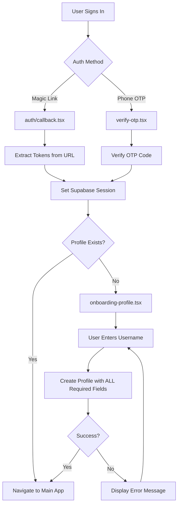

# Design Document: Auth Critical Fixes

## Overview

This design addresses critical authentication and database issues in the HeySalad Wallet application. The primary issues are:

1. **Profile Creation Failure**: The `profiles` table requires a `name` field that isn't being provided during profile creation
2. **Supabase Query Timeouts**: Queries are hanging or timing out, blocking the UI
3. **Metro Bundler Cache**: Stale code may be running despite file changes
4. **ErrorBoundary Import**: Potential undefined reference errors

The solution involves fixing the profile creation to include all required fields, improving timeout handling, and ensuring proper error boundaries.

## Architecture



## Components and Interfaces

### 1. Profile Creation (onboarding-profile.tsx)

**Current Issue**: Missing `name` field in profile creation.

**Solution**: Add `name` field to profile data, using username as default value.

```typescript
interface ProfileData {
  auth_user_id: string;
  username: string;
  name: string;           // REQUIRED - use username as default
  email?: string;         // Optional - from email auth
  phone?: string;         // Optional - from phone auth
}
```

### 2. SupabaseProvider (providers/SupabaseProvider.tsx)

**Current Issue**: Queries can hang indefinitely, safety timeout triggers too often.

**Solution**: 
- Add proper query timeout using AbortController
- Improve error classification (network vs server vs timeout)
- Add retry logic with exponential backoff

```typescript
interface QueryOptions {
  timeout?: number;       // Default: 5000ms
  retries?: number;       // Default: 2
  retryDelay?: number;    // Default: 1000ms
}

interface NetworkError {
  type: 'offline' | 'timeout' | 'server' | 'unknown';
  message: string;
  retryable: boolean;
}
```

### 3. ErrorBoundary (components/ErrorBoundary.tsx)

**Current State**: Component exists and exports correctly as a named export.

**Verification**: The ErrorBoundary uses `Colors.brand.surface`, `Colors.brand.red`, `Colors.brand.ink`, and `Colors.brand.inkMuted` - all of which exist in `constants/colors.ts`.

### 4. Magic Link Handler (app/auth/callback.tsx)

**Current State**: Handles token extraction from magic link URLs.

**Required Behavior**:
- Extract `access_token` and `refresh_token` from URL hash
- Set Supabase session with extracted tokens
- Check for existing profile
- Route to onboarding or main app accordingly

## Data Models

### Profiles Table Schema (Expected)

Based on the error message, the `profiles` table likely has this schema:

```sql
CREATE TABLE profiles (
  auth_user_id UUID PRIMARY KEY REFERENCES auth.users(id),
  username TEXT UNIQUE NOT NULL,
  name TEXT NOT NULL,              -- This is the missing field!
  email TEXT,
  phone TEXT,
  created_at TIMESTAMPTZ DEFAULT NOW(),
  updated_at TIMESTAMPTZ DEFAULT NOW()
);
```

### Profile Interface (TypeScript)

```typescript
interface Profile {
  auth_user_id: string;
  username: string;
  name: string;
  email?: string;
  phone?: string;
  created_at: string;
  updated_at: string;
}
```

## Correctness Properties

*A property is a characteristic or behavior that should hold true across all valid executions of a system-essentially, a formal statement about what the system should do. Properties serve as the bridge between human-readable specifications and machine-verifiable correctness guarantees.*

### Property 1: Profile Creation Includes All Required Fields

*For any* valid username and authenticated user, when creating a profile, the profile data object SHALL contain all NOT NULL fields defined in the database schema (auth_user_id, username, name).

**Validates: Requirements 1.1, 1.2, 6.3**

### Property 2: Contact Information Matches Auth Method

*For any* authenticated user, when creating a profile, if the user authenticated via email then the profile SHALL contain the email field, and if the user authenticated via phone then the profile SHALL contain the phone field.

**Validates: Requirements 1.3**

### Property 3: Magic Link Token Extraction

*For any* valid magic link URL containing access_token and refresh_token in the hash fragment, the token extraction function SHALL return both tokens correctly parsed.

**Validates: Requirements 3.1**

### Property 4: Profile Routing Logic

*For any* authenticated session, when checking for profile existence, if a profile exists the app SHALL route to the main wallet screen, and if no profile exists the app SHALL route to the onboarding screen.

**Validates: Requirements 3.3**

### Property 5: Malformed URL Handling

*For any* magic link URL that is malformed or missing required tokens, the URL parser SHALL return an error result and the app SHALL redirect to sign-in with an error message.

**Validates: Requirements 3.4**

### Property 6: Error Classification

*For any* network error during Supabase operations, the error handler SHALL classify the error as one of: offline, timeout, or server error, and return an appropriate user-facing message.

**Validates: Requirements 2.3**

### Property 7: ErrorBoundary Catches Errors

*For any* error thrown within the ErrorBoundary's children, the ErrorBoundary SHALL catch the error and render an error UI with the error message and a reset button.

**Validates: Requirements 5.1**

## Error Handling

### Profile Creation Errors

| Error Type | User Message | Action |
|------------|--------------|--------|
| Constraint violation (name) | "Profile creation failed. Please try again." | Show error, allow retry |
| Username taken | "Username is already taken. Please choose another one." | Clear input, focus field |
| Network error | "Unable to connect. Please check your internet connection." | Show retry button |
| Unknown error | "An unexpected error occurred. Please try again." | Show retry button |

### Supabase Query Errors

| Error Type | Detection | User Message |
|------------|-----------|--------------|
| Offline | `!navigator.onLine` or fetch fails | "You appear to be offline. Please check your connection." |
| Timeout | Query exceeds 5 seconds | "Request timed out. Please try again." |
| Server error | HTTP 5xx response | "Server error. Please try again later." |
| Auth error | HTTP 401/403 | "Session expired. Please sign in again." |

### Retry Strategy

```typescript
const retryConfig = {
  maxRetries: 2,
  initialDelay: 1000,
  maxDelay: 5000,
  backoffMultiplier: 2,
};
```

## Testing Strategy

### Unit Testing

Unit tests will verify specific examples and edge cases:

1. **Profile Creation**
   - Test with valid username creates profile
   - Test with empty username shows error
   - Test with duplicate username shows appropriate error
   - Test profile data includes all required fields

2. **Token Extraction**
   - Test valid magic link URL extracts tokens
   - Test malformed URL returns error
   - Test missing tokens returns error

3. **Error Classification**
   - Test network offline detection
   - Test timeout detection
   - Test server error detection

### Property-Based Testing

Property-based tests will use **fast-check** library to verify universal properties across many inputs.

**Configuration**: Each property test will run a minimum of 100 iterations.

**Test Annotation Format**: Each property-based test will be tagged with:
`**Feature: auth-critical-fixes, Property {number}: {property_text}**`

#### Property Tests to Implement

1. **Profile Data Completeness**
   - Generate random valid usernames
   - Verify profile data always includes auth_user_id, username, and name

2. **Token Extraction Round-Trip**
   - Generate random valid tokens
   - Create magic link URL with tokens
   - Extract tokens and verify they match original

3. **Error Classification Coverage**
   - Generate various error types
   - Verify each is classified correctly

4. **Routing Logic Consistency**
   - Generate sessions with/without profiles
   - Verify routing decision is consistent

### Integration Testing

Manual testing checklist:
- [ ] Magic link authentication end-to-end
- [ ] Phone OTP authentication end-to-end
- [ ] Profile creation with all fields
- [ ] Error display and retry functionality
- [ ] Network timeout handling

## Implementation Notes

### Metro Cache Clearing

To ensure fresh code is running:

```bash
# Clear Metro cache
npx expo start --clear

# Or manually clear
rm -rf node_modules/.cache
rm -rf .expo
watchman watch-del-all  # If using watchman
```

### Database Schema Verification

Before implementing, verify the actual `profiles` table schema in Supabase:

```sql
SELECT column_name, data_type, is_nullable, column_default
FROM information_schema.columns
WHERE table_name = 'profiles'
ORDER BY ordinal_position;
```

### RLS Policy Check

Verify RLS policies allow profile creation:

```sql
SELECT * FROM pg_policies WHERE tablename = 'profiles';
```
