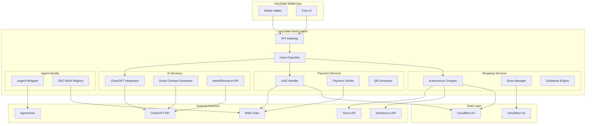

# HeySalad Web3 Agent - Design Document

## Overview

The HeySalad Web3 Agent is a multi-bounty AI-powered autonomous commerce platform that combines:
- **ChainGPT** for Web3 AI capabilities (chat, smart contracts, research)
- **x402 Protocol** for machine-to-machine payments on BNB Chain
- **ERC-8004** for on-chain agent identity
- **Fetch.ai uAgents** for decentralized agent deployment
- **Autonomous Shopping** for UK supermarket automation

The system is deployed as a Cloudflare Worker with integrations to the HeySalad Wallet mobile app.

## Architecture



## Components and Interfaces

### 1. API Gateway (`src/index.ts`)

Main entry point handling routing and CORS.

```typescript
interface GatewayConfig {
  corsOrigins: string[];
  rateLimitPerMinute: number;
  apiVersion: string;
}

// Endpoints
POST /api/chat              // AI chat with intent routing
POST /api/payment/create    // Create x402 payment request
POST /api/payment/verify    // Verify payment
GET  /api/agent/info        // ERC-8004 agent info
POST /api/shop/start        // Start autonomous shopping
GET  /api/shop/status/:id   // Get shopping session status
POST /api/uagent/message    // uAgent protocol endpoint
```

### 2. Intent Classifier (`src/classifier.ts`)

Routes user messages to appropriate services.

```typescript
type Intent = 'shopping' | 'payment' | 'blockchain' | 'contract' | 'unknown';

interface ClassificationResult {
  intent: Intent;
  confidence: number;
  entities: ExtractedEntities;
}

interface ExtractedEntities {
  // Shopping entities
  items?: Array<{ name: string; quantity: number }>;
  store?: string;
  
  // Payment entities
  amount?: number;
  currency?: string;
  recipient?: string;
  
  // Blockchain entities
  chain?: string;
  token?: string;
  project?: string;
}

function classifyIntent(message: string): Promise<ClassificationResult>;
function extractEntities(message: string, intent: Intent): Promise<ExtractedEntities>;
```

### 3. ChainGPT Integration (`src/chaingpt.ts`)

Wrapper for ChainGPT APIs.

```typescript
interface ChainGPTConfig {
  apiKey: string;
  baseUrl: string;
  timeout: number;
}

interface ChatResponse {
  content: string;
  sources?: string[];
  confidence: number;
}

interface ContractResponse {
  code: string;
  abi: object[];
  compilerVersion: string;
  isValid: boolean;
  errors?: string[];
}

class ChainGPTService {
  async chat(message: string, context?: string): Promise<ChatResponse>;
  async generateContract(spec: ContractSpec): Promise<ContractResponse>;
  async getNews(query: string): Promise<NewsItem[]>;
  async validateSolidity(code: string): Promise<ValidationResult>;
}
```

### 4. x402 Payment Handler (`src/x402.ts`)

Implements x402 protocol for BNB Chain.

```typescript
interface PaymentRequest {
  id: string;
  amount: string;          // In wei/smallest unit
  asset: string;           // USDC contract address
  recipient: string;       // HeySalad wallet
  chain: 'bnb' | 'avalanche';
  description: string;
  expiresAt: number;
}

interface PaymentProof {
  transactionHash: string;
  signature: string;
  timestamp: number;
}

interface PaymentStatus {
  id: string;
  status: 'pending' | 'completed' | 'failed' | 'expired';
  transactionHash?: string;
  completedAt?: number;
}

class X402Handler {
  createPaymentRequest(amount: number, description: string): Promise<PaymentRequest>;
  verifyPayment(paymentId: string, proof: PaymentProof): Promise<boolean>;
  generateQRCode(request: PaymentRequest): Promise<string>;
  serializeRequest(request: PaymentRequest): string;
  deserializeResponse(json: string): PaymentProof;
}
```

### 5. ERC-8004 Agent Registry (`src/erc8004.ts`)

On-chain agent identity management.

```typescript
interface AgentCapabilities {
  shopping: boolean;
  payments: boolean;
  aiChat: boolean;
  contractGeneration: boolean;
  supportedChains: string[];
  supportedStores: string[];
}

interface AgentIdentity {
  address: string;
  publicKey: string;
  capabilities: AgentCapabilities;
  registeredAt: number;
  updatedAt: number;
}

class ERC8004Registry {
  async register(capabilities: AgentCapabilities): Promise<string>;
  async updateCapabilities(capabilities: AgentCapabilities): Promise<void>;
  async getIdentity(address: string): Promise<AgentIdentity>;
  async verifySignature(message: string, signature: string): Promise<boolean>;
}
```

### 6. uAgent Wrapper (`src/uagent.ts`)

Fetch.ai uAgent protocol implementation.

```typescript
interface UAgentMessage {
  sender: string;
  recipient: string;
  type: 'shopping' | 'payment' | 'query';
  payload: unknown;
  timestamp: number;
}

interface UAgentResponse {
  success: boolean;
  data: unknown;
  error?: string;
}

class UAgentWrapper {
  async initialize(agentAddress: string): Promise<void>;
  async handleMessage(message: UAgentMessage): Promise<UAgentResponse>;
  async sendMessage(recipient: string, message: UAgentMessage): Promise<void>;
  async registerWithAgentverse(): Promise<void>;
}
```

### 7. Autonomous Shopping Service (`src/shopping.ts`)

Handles store automation.

```typescript
interface ShoppingRequest {
  userId: string;
  store: 'tesco' | 'sainsburys' | 'asda' | 'ocado';
  items: Array<{ name: string; quantity: number; preferences?: ItemPreferences }>;
  deliveryAddress: Address;
  budgetLimit?: number;
  allowSubstitutes: boolean;
}

interface ShoppingResult {
  sessionId: string;
  itemsAdded: CartItem[];
  itemsUnavailable: string[];
  substitutes: SubstituteItem[];
  cartTotal: number;
  deliveryFee: number;
  paymentLink: string;
}

interface SessionState {
  id: string;
  userId: string;
  store: string;
  status: 'in_progress' | 'completed' | 'failed' | 'paused';
  cartItems: CartItem[];
  lastCheckpoint: string;
  createdAt: number;
  updatedAt: number;
}

class AutonomousShoppingService {
  async startShopping(request: ShoppingRequest): Promise<ShoppingResult>;
  async getSessionStatus(sessionId: string): Promise<SessionState>;
  async resumeSession(sessionId: string): Promise<ShoppingResult>;
  async saveSessionState(state: SessionState): Promise<void>;
  async findSubstitutes(item: string, preferences: ItemPreferences): Promise<SubstituteItem[]>;
}
```

### 8. Credential Manager (`src/credentials.ts`)

Secure credential storage with AES-256-GCM.

```typescript
interface EncryptedCredential {
  userId: string;
  store: string;
  encryptedEmail: string;
  encryptedPassword: string;
  iv: string;
  authTag: string;
  createdAt: number;
}

class CredentialManager {
  async storeCredentials(userId: string, store: string, email: string, password: string): Promise<void>;
  async getCredentials(userId: string, store: string): Promise<{ email: string; password: string }>;
  async deleteCredentials(userId: string, store?: string): Promise<void>;
  async rotateEncryptionKey(userId: string): Promise<void>;
}
```

## Data Models

### Payment Request (D1)

```sql
CREATE TABLE payment_requests (
  id TEXT PRIMARY KEY,
  amount TEXT NOT NULL,
  asset TEXT NOT NULL,
  recipient TEXT NOT NULL,
  chain TEXT NOT NULL,
  description TEXT,
  status TEXT DEFAULT 'pending',
  transaction_hash TEXT,
  created_at INTEGER NOT NULL,
  expires_at INTEGER NOT NULL,
  completed_at INTEGER
);
```

### Shopping Sessions (D1)

```sql
CREATE TABLE shopping_sessions (
  id TEXT PRIMARY KEY,
  user_id TEXT NOT NULL,
  store TEXT NOT NULL,
  status TEXT DEFAULT 'in_progress',
  cart_items TEXT,  -- JSON
  items_unavailable TEXT,  -- JSON
  cart_total REAL,
  delivery_fee REAL,
  payment_link TEXT,
  last_checkpoint TEXT,
  created_at INTEGER NOT NULL,
  updated_at INTEGER NOT NULL
);
```

### User Credentials (D1 - Encrypted)

```sql
CREATE TABLE user_credentials (
  id TEXT PRIMARY KEY,
  user_id TEXT NOT NULL,
  store TEXT NOT NULL,
  encrypted_email TEXT NOT NULL,
  encrypted_password TEXT NOT NULL,
  iv TEXT NOT NULL,
  auth_tag TEXT NOT NULL,
  created_at INTEGER NOT NULL,
  updated_at INTEGER NOT NULL,
  UNIQUE(user_id, store)
);
```

### Agent Identity (KV)

```typescript
// Key: agent:identity
interface StoredAgentIdentity {
  address: string;
  privateKey: string;  // Encrypted
  capabilities: AgentCapabilities;
  registrationTx: string;
}
```

## Correctness Properties

*A property is a characteristic or behavior that should hold true across all valid executions of a system-essentially, a formal statement about what the system should do. Properties serve as the bridge between human-readable specifications and machine-verifiable correctness guarantees.*

### Property 1: Smart Contract Compilation Validity
*For any* valid contract specification, the generated Solidity code SHALL compile without errors using solc 0.8.x
**Validates: Requirements 1.2, 1.5**

### Property 2: ChainGPT Fallback on Error
*For any* ChainGPT API error, the system SHALL return a valid response using local AI capabilities without throwing an exception
**Validates: Requirements 1.4**

### Property 3: x402 Payment Request Round-Trip
*For any* valid PaymentRequest object, serializing to JSON and deserializing back SHALL produce an equivalent object with all fields preserved
**Validates: Requirements 2.6, 2.7**

### Property 4: Protected Endpoint 402 Response
*For any* protected endpoint accessed without an X-Payment header, the response SHALL be HTTP 402 with valid payment details including amount, recipient, and asset
**Validates: Requirements 2.1**

### Property 5: Valid Payment Grants Access
*For any* valid payment proof with confirmed on-chain transaction, the protected resource SHALL be accessible within 3 seconds
**Validates: Requirements 2.2**

### Property 6: Invalid Payment Error Messages
*For any* invalid payment proof, the error response SHALL contain a descriptive message indicating the specific failure reason
**Validates: Requirements 2.3**

### Property 7: Payment Status Transitions
*For any* payment, the status SHALL only transition in valid sequences: pending → completed OR pending → failed OR pending → expired
**Validates: Requirements 2.5**

### Property 8: Agent Identity Signature Verification
*For any* message signed by the agent's private key, verification against the registered public key SHALL return true
**Validates: Requirements 3.4**

### Property 9: uAgent Message Handling
*For any* valid uAgent message of type shopping, payment, or query, the handler SHALL return a well-formed UAgentResponse within 30 seconds
**Validates: Requirements 4.2, 4.3, 4.4**

### Property 10: Credential Encryption Round-Trip
*For any* user credentials (email, password), encrypting and then decrypting SHALL return the original values exactly
**Validates: Requirements 5.1, 5.6**

### Property 11: Shopping Cart State Consistency
*For any* shopping session, the cart total SHALL equal the sum of all item prices multiplied by their quantities
**Validates: Requirements 5.2**

### Property 12: Unavailable Item Substitution
*For any* unavailable item in a shopping request with allowSubstitutes=true, the system SHALL return at least one substitute suggestion
**Validates: Requirements 5.3**

### Property 13: PII Redaction in Logs
*For any* log entry, the content SHALL NOT contain patterns matching email addresses, phone numbers, or credit card numbers
**Validates: Requirements 7.4**

### Property 14: Intent Classification Routing
*For any* message with clear shopping, payment, or blockchain intent, the classifier SHALL route to the correct service with confidence >= 70%
**Validates: Requirements 8.1**

### Property 15: Entity Extraction Completeness
*For any* shopping message containing item names and quantities, the extractor SHALL identify all items with their quantities
**Validates: Requirements 8.2, 8.3**

### Property 16: Chain-Specific Contract Routing
*For any* payment request specifying a supported chain, the system SHALL use the correct USDC contract address for that chain
**Validates: Requirements 9.1, 9.2**

### Property 17: Session State Recovery
*For any* saved session state, loading and resuming SHALL restore the exact cart contents and progress that existed before saving
**Validates: Requirements 10.1, 10.5**

## Error Handling

### API Errors
- ChainGPT unavailable: Fall back to local GPT-4o, log error, notify user
- BNB Chain RPC error: Retry with backup RPC, queue for later if all fail
- Store API error: Save session state, notify user, allow manual retry

### Payment Errors
- Invalid signature: Return 400 with "Invalid payment signature"
- Transaction not found: Poll for 5 minutes, then return "Transaction not confirmed"
- Insufficient funds: Return 402 with required amount

### Shopping Errors
- Login failed: Return "Authentication failed, please update credentials"
- Item not found: Add to unavailable list, suggest substitutes
- Cart limit reached: Notify user, offer to split into multiple orders

## Testing Strategy

### Unit Testing
- Use Vitest for all unit tests
- Mock external APIs (ChainGPT, BNB Chain, Store APIs)
- Test each component in isolation
- Minimum 80% code coverage

### Property-Based Testing
- Use fast-check library for property-based tests
- Configure minimum 100 iterations per property
- Test all 17 correctness properties
- Tag each test with property reference: `**Feature: heysalad-web3-agent, Property {N}: {description}**`

### Integration Testing
- Test full flows: chat → intent → service → response
- Test payment flow: create → QR → verify → access
- Test shopping flow: start → add items → checkout → payment link

### Test Structure
```
tests/
├── unit/
│   ├── classifier.test.ts
│   ├── chaingpt.test.ts
│   ├── x402.test.ts
│   ├── credentials.test.ts
│   └── shopping.test.ts
├── property/
│   ├── x402-roundtrip.property.test.ts
│   ├── credentials-encryption.property.test.ts
│   ├── intent-classification.property.test.ts
│   ├── cart-consistency.property.test.ts
│   └── pii-redaction.property.test.ts
└── integration/
    ├── chat-flow.test.ts
    ├── payment-flow.test.ts
    └── shopping-flow.test.ts
```
