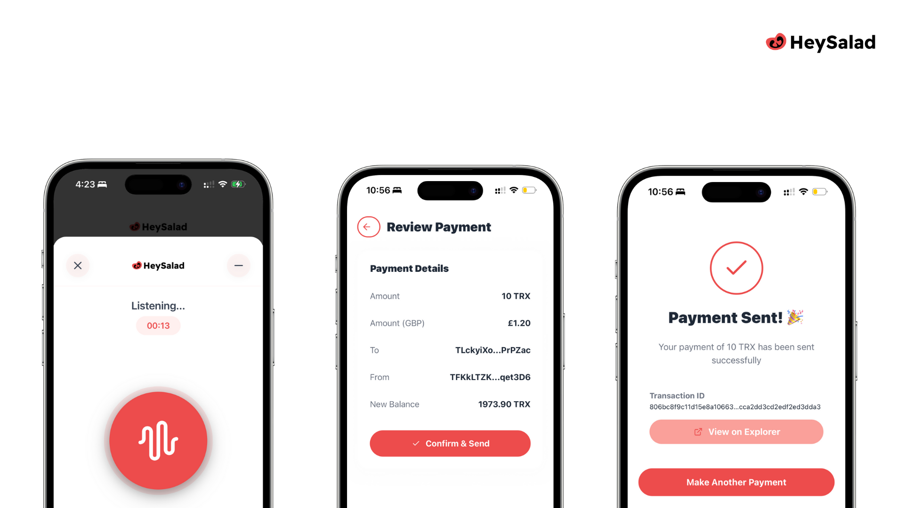
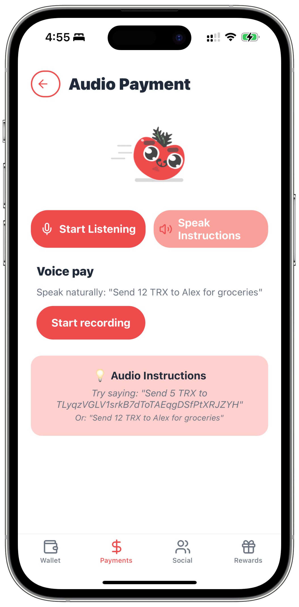
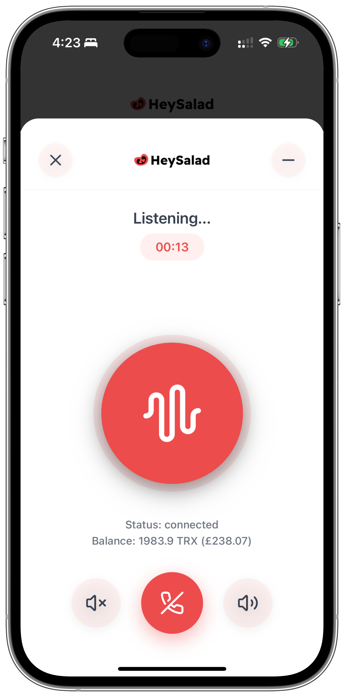
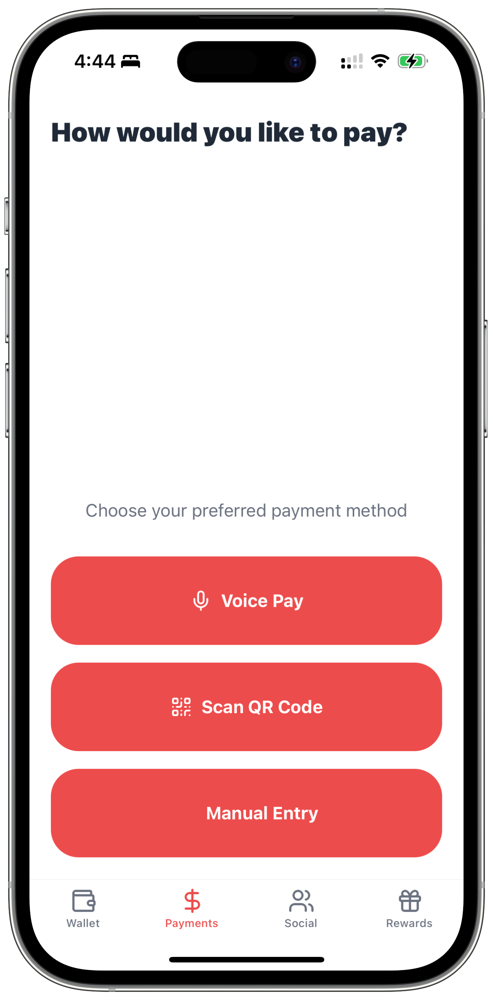
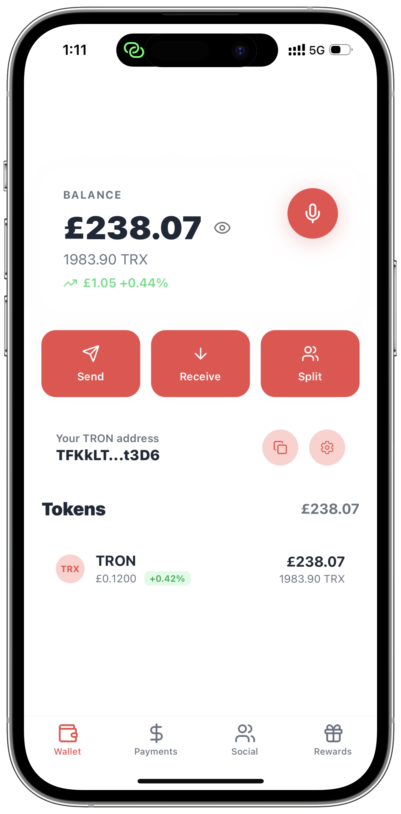
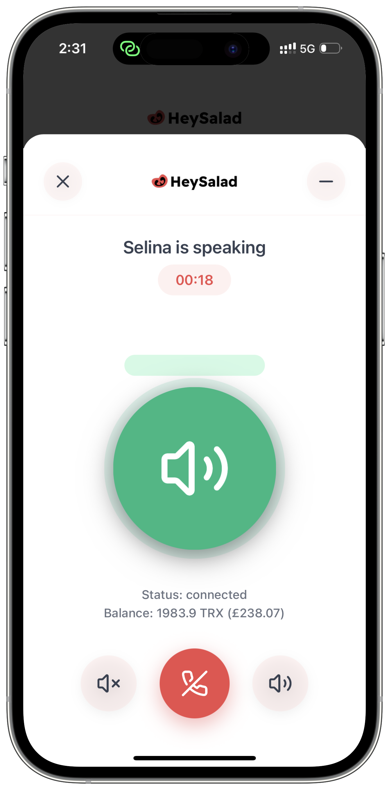
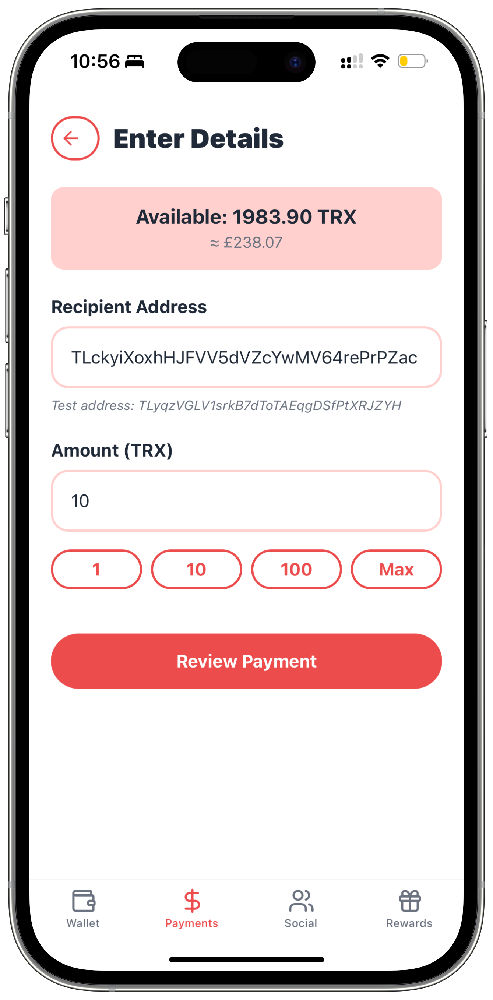
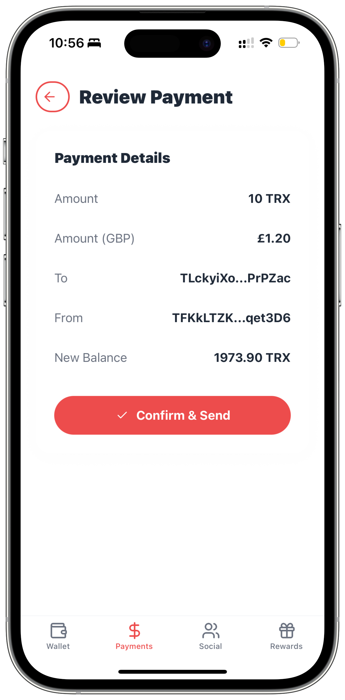
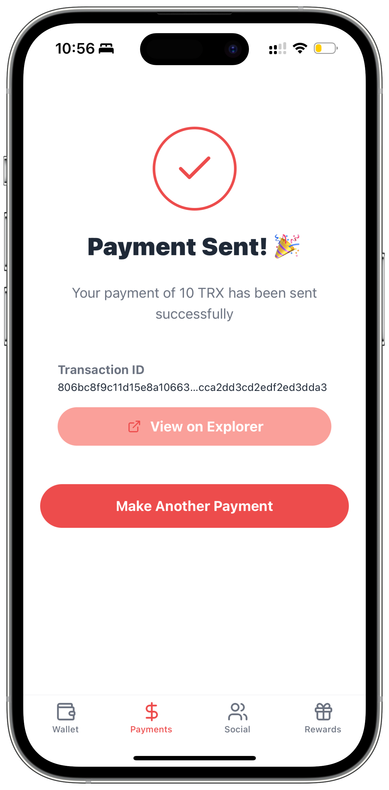

# HeySalad® Wallet 🥗



> **An AI-powered voice cryptocurrency wallet prototype with biometric security**

An experimental TRON wallet exploring voice-controlled payments, AI assistance, and biometric authentication to make cryptocurrency more accessible.

[](https://reactnative.dev/)
[](https://expo.dev/)
[](https://www.typescriptlang.org/)
[](https://tronscan.org/)
[](#license)

## 🏆 **TRON Hackathon Entry**

**Submitted for TRON ecosystem development bounties**

This prototype demonstrates potential innovations in:
- Voice-controlled cryptocurrency transactions
- AI-powered wallet management
- Biometric security implementation
- Natural language payment processing

---

## ✨ **Key Features**

### 🎙️ **Voice Payment Interface**
- Natural language command recognition
- "Send X TRX to address" processing
- Voice-guided transaction flow
- ElevenLabs AI integration for responses

### 🔐 **Biometric Security**
- Face ID/Touch ID authentication
- Secure key storage implementation
- Multiple security fallback methods
- Transaction authorization protection

### 🤖 **AI Financial Assistant - "Selina"**
- Conversational wallet interaction
- Transaction guidance and explanations
- Balance inquiries and account management
- British accent voice synthesis

### 💳 **Multiple Payment Methods**
- **Voice Commands** - Natural language input
- **QR Code Scanner** - Camera-based address input  
- **Manual Entry** - Traditional form interface
- **Quick Amount** buttons for common values

---

## 📱 **Screenshots**

| Audio Payment | Voice Payment | Payment Methods | Home Screen |
|-------------|---------------|-----------------|------------------|
|  |  |  |  |

| AI Assistant | Manual Payment | Payment Comfirmation | Success Screen |
|--------------|----------|------------|----------------|
|  |  |  |  |

---

## 🛠 **Technical Implementation**

### **Architecture**
- **Frontend:** React Native with Expo SDK 53
- **Blockchain:** TRON network integration via TronGrid API
- **AI/Voice:** ElevenLabs API for speech synthesis and recognition
- **Security:** iOS/Android biometric authentication APIs
- **State Management:** React Context with TypeScript

### **Core Components**
```
src/
├── app/                     # Expo Router navigation
├── components/              # Reusable UI components
│   ├── AudioPay.tsx        # Voice payment interface
│   ├── SelinaVoiceModal.tsx # AI assistant modal
│   └── SecurityAuth.tsx    # Biometric authentication
├── providers/              # React Context providers
│   ├── WalletProvider.tsx  # Wallet state management
│   └── AuthProvider.tsx    # Authentication flow
└── constants/              # App configuration
```

### **Voice Command Processing**
```javascript
// Example supported commands
"Send 10 TRX to [address]"
"What's my balance?"
"Transfer 5 TRX to Alice"
"Pay 20 TRX for groceries"
```

---

## 🚀 **Getting Started**

### **Prerequisites**
- Node.js 18+ with npm/yarn
- iOS Simulator or Android Emulator
- Expo CLI (`npm install -g @expo/cli`)

### **Installation**
```bash
# Clone repository
git clone https://github.com/hey-salad/heysalad-wallet.git
cd heysalad-wallet

# Install dependencies
npm install

# Configure environment variables
cp .env.example .env
# Add your API keys (see Environment Setup below)

# Start development server
npm run start
```

### **Environment Setup**
Create `.env` file with your API credentials:

```env
# TRON Network Configuration
EXPO_PUBLIC_TRONGRID_URL=https://api.trongrid.io
EXPO_PUBLIC_TRONGRID_API_KEY=your_trongrid_api_key

# ElevenLabs AI Configuration  
EXPO_PUBLIC_ELEVENLABS_API_KEY=your_elevenlabs_api_key
EXPO_PUBLIC_ELEVENLABS_VOICE_ID=your_voice_id
EXPO_PUBLIC_ELEVENLABS_AGENT_ID=your_agent_id

# Generate your own private key for testing
EXPO_PUBLIC_TRON_PRIVATE_KEY=your_test_private_key
```

**⚠️ Security Notice:** Never commit real private keys or mainnet credentials to version control.

---

## 🧪 **Testing**

### **Voice Commands**
1. Start the app and navigate to "Audio Pay"
2. Grant microphone permissions
3. Test voice commands:
   - "Send 1 TRX to [test address]"
   - "What's my balance?"
   - "Transfer 5 TRX to Alice"

### **Biometric Authentication**
1. Enable Face ID/Touch ID in device settings
2. Attempt any transaction
3. Verify biometric prompt appears
4. Test authentication success/failure flows

### **TRON Integration**
- Uses TRON testnet for safe development
- Transactions visible on [TRON testnet explorer](https://nile.tronscan.org/)
- No real funds at risk during testing

---

## 🚧 **Current Status & Limitations**

### **Working Features**
✅ Voice command recognition and processing  
✅ Biometric authentication integration  
✅ TRON wallet connection and balance display  
✅ AI voice assistant (Selina) basic responses  
✅ QR code scanning for addresses  
✅ Transaction creation and signing  

### **Known Issues**
⚠️ **Signature Format:** Transaction broadcasting needs refinement for mainnet compatibility  
⚠️ **Voice Processing:** Accuracy depends on device microphone and background noise  
⚠️ **AI Integration:** ElevenLabs quota limitations may affect extended testing  
⚠️ **Network Dependency:** Requires stable internet for AI and blockchain features  

### **Planned Improvements**
- Enhanced voice recognition accuracy
- Expanded AI conversation capabilities
- Transaction history and address book
- Additional blockchain network support
- Improved error handling and offline capabilities

---

## 🤝 **Contributing**

We welcome contributions to improve this prototype:

1. **Fork** the repository
2. **Create** a feature branch (`git checkout -b feature/amazing-feature`)
3. **Commit** your changes (`git commit -m 'Add amazing feature'`)
4. **Push** to the branch (`git push origin feature/amazing-feature`)
5. **Open** a Pull Request

### **Development Guidelines**
- Follow existing TypeScript and React Native patterns
- Test on both iOS and Android platforms
- Update documentation for new features
- Maintain security best practices

---

## 📚 **Documentation**

### **API Integration**
- **TRON Network:** [TronGrid Documentation](https://developers.tron.network/)
- **ElevenLabs AI:** [ElevenLabs API Docs](https://elevenlabs.io/docs/)
- **Expo Biometrics:** [Local Authentication](https://docs.expo.dev/versions/latest/sdk/local-authentication/)

### **Voice Command Syntax**
```javascript
// Payment patterns
"Send [amount] TRX to [address/name]"
"Transfer [amount] TRX to [recipient] for [description]"
"Pay [amount] TRX for [item/service]"

// Query patterns  
"What's my balance?"
"Show my recent transactions"
"How much TRX do I have?"
```

---

## ⚖️ **License**

This project is licensed under a Custom License - see the [LICENSE](LICENSE) file for details.

**HeySalad®** (UK Trademark Registration No. **UK00004063403**) is a registered trademark of **SALADHR TECHNOLOGY LTD**.

---

## 🙏 **Acknowledgments**

- **TRON Foundation** for blockchain infrastructure and hackathon opportunities
- **ElevenLabs** for advanced AI voice technology
- **Expo Team** for excellent React Native development tools
- **Open Source Community** for countless libraries and resources

---

## 📞 **Contact & Support**

- **Issues:** [GitHub Issues](https://github.com/Hey-Salad/heysalad-wallet/issues)
- **Discussions:** [GitHub Discussions](https://github.com/Hey-Salad/heysalad-wallet/discussions)
- **Email:** [Contact SALADHR TECHNOLOGY LTD](mailto:peter@saladhr.com)

---

## ⚠️ **Disclaimer**

This is an experimental prototype built for educational and hackathon purposes. The software is provided "as is" without warranties. Users should exercise caution and never use real cryptocurrency funds without proper testing and security audits.

**Not financial advice.** **Use at your own risk.** **Test with small amounts only.**

---

<div align="center">

**Built with ❤️ for the TRON ecosystem**

*Exploring the future of accessible cryptocurrency interactions*

[⭐ Star this repo](https://github.com/Hey-Salad/heysalad-wallet) • [🐛 Report Issues](https://github.com/Hey-Salad/heysalad-wallet/issues) • [💬 Discussions](https://github.com/Hey-Salad/heysalad-wallet/discussions)

</div>
