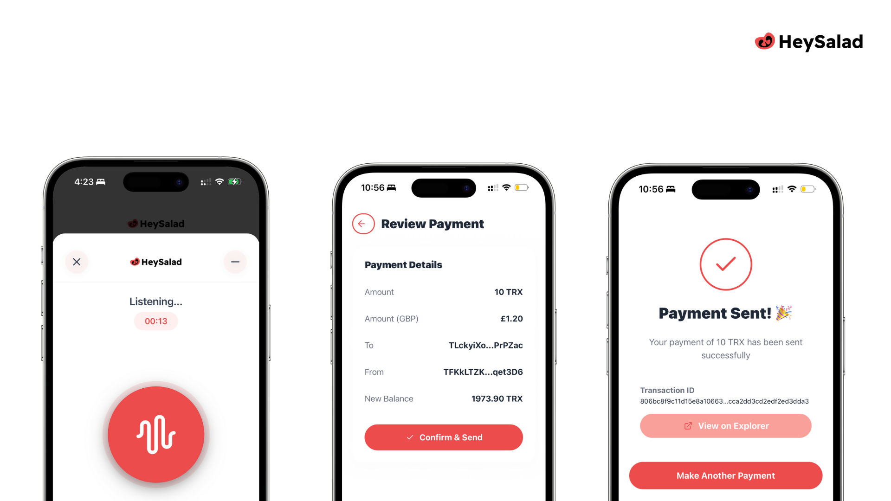
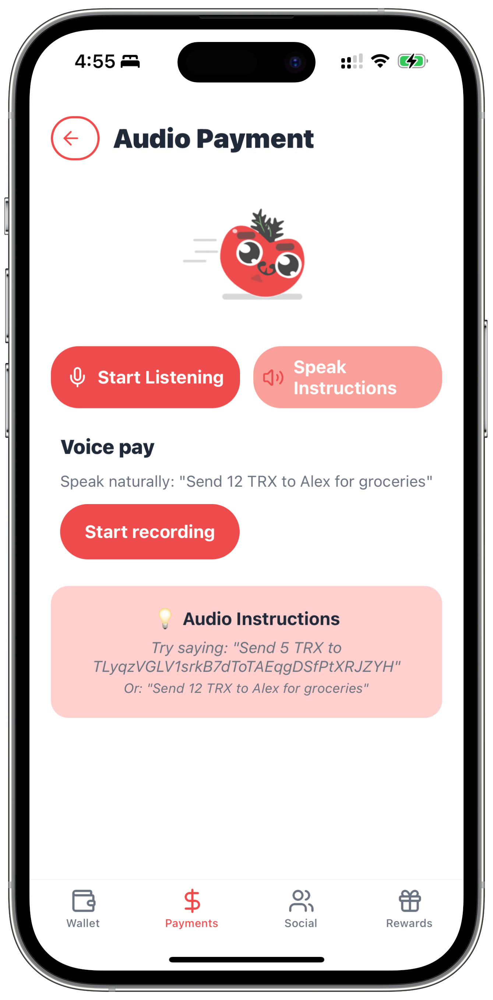
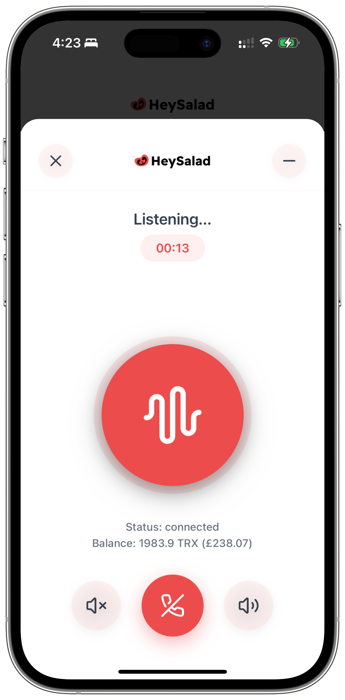
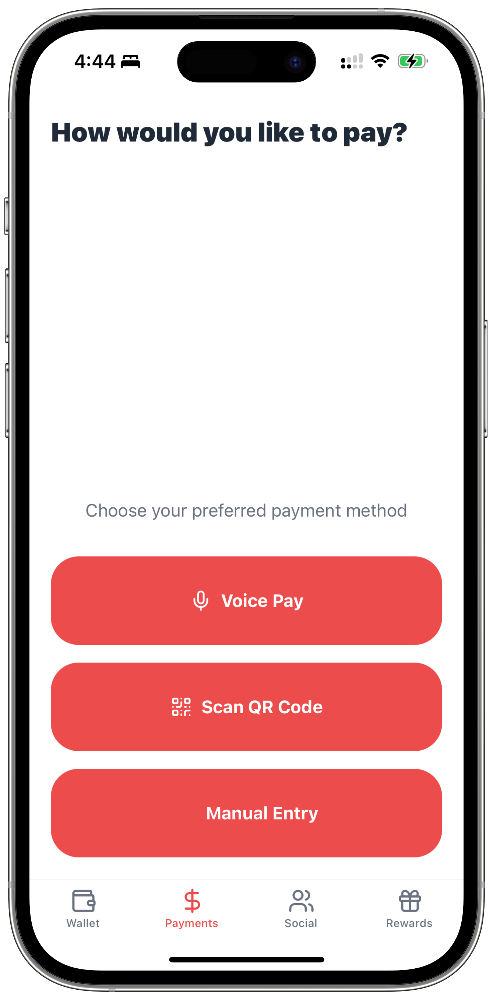
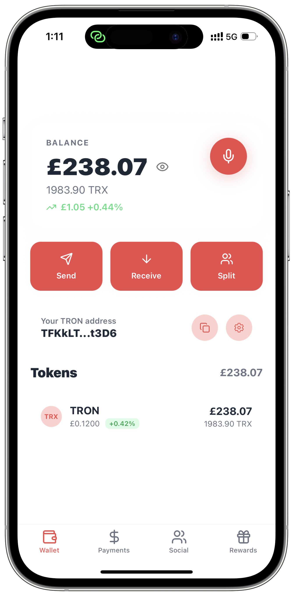
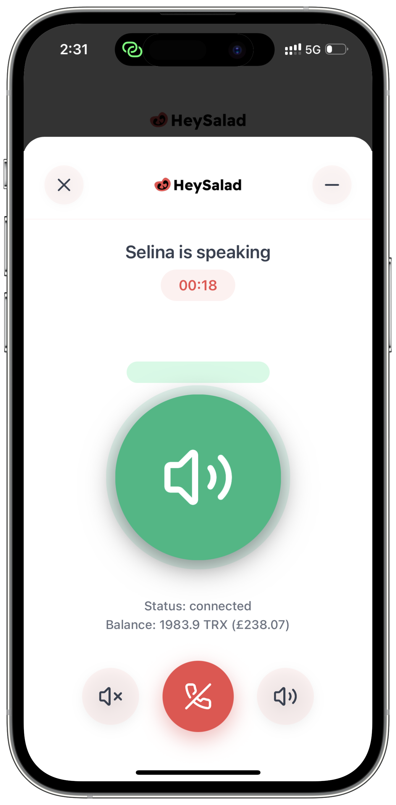
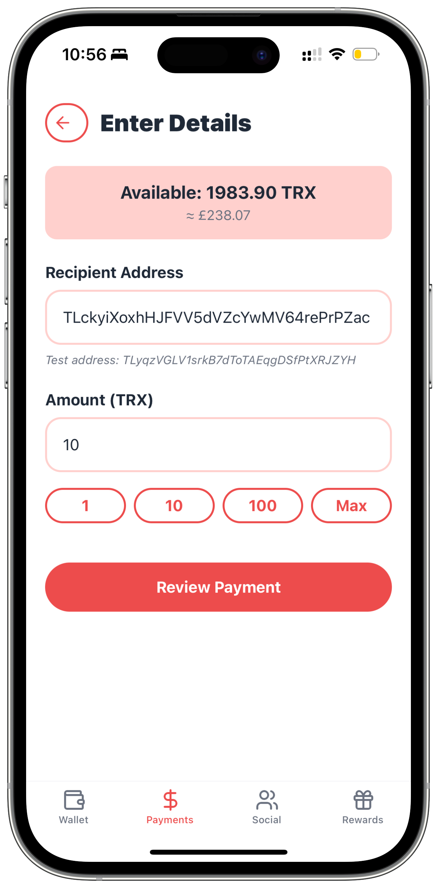
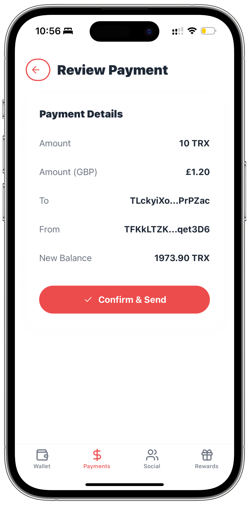
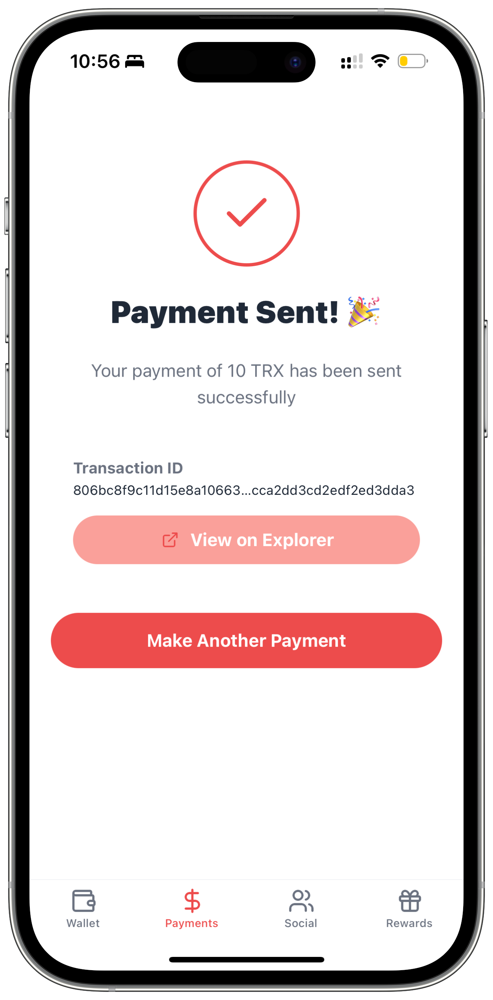

# HeySalad® Wallet



> **Privacy-first voice cryptocurrency wallet with AI assistance and zero-knowledge proofs**

A production-ready mobile wallet combining voice-controlled payments, Midnight Network privacy features, and multi-chain blockchain support with enterprise-grade biometric security.

[](https://reactnative.dev/)
[](https://expo.dev/)
[](https://www.typescriptlang.org/)
[](https://tronscan.org/)
[](https://midnight.network/)
[](#license)

## 🏆 **Hackathon Submissions**

**Active Submissions:**
- **TRON Hackathon** - Voice-controlled cryptocurrency transactions
- **Midnight Network Hackathon** - Privacy-preserving payments with ZK proofs ($5,000 USDC prize)
- **UK AI Agent Hackathon EP3** - AI-powered financial assistant

---

## ✨ **Key Features**

### 🌙 **Privacy-Preserving Transactions (Midnight Network)** ⭐ NEW
- **Zero-Knowledge Proofs** - Hide transaction amounts from public blockchain
- **Private Voice Payments** - "Send 100 DUST privately to [address]"
- **Selective Disclosure** - Prove validity without revealing data
- **ZK Circuit Integration** - Cryptographic proof generation
- **Networks:** midnight-testnet, midnight-mainnet

### 🎙️ **Voice Payment Interface**
- Natural language command recognition
- "Send X TRX to address" processing
- "Send X DUST privately to address" for Midnight Network
- Voice-guided transaction flow
- ElevenLabs AI integration for British accent responses

### 🔐 **Enterprise-Grade Security**
- Face ID/Touch ID biometric authentication
- Secure key storage via iOS Keychain / Android Keystore
- Auto-lock with configurable timeouts
- PIN fallback authentication
- Encrypted private key management

### 🤖 **AI Financial Assistant - "Selina"**
- Conversational wallet interaction
- Transaction guidance and explanations
- Balance inquiries across multiple networks
- British accent voice synthesis
- Privacy-aware command processing

### ⛓️ **Multi-Chain Support**
- **TRON Mainnet** - Production transactions
- **TRON Nile Testnet** - Safe development
- **Midnight Testnet** - Private transaction testing
- **Midnight Mainnet** - Production privacy features
- Easy to add: Solana, Polkadot, Avalanche, Base, Polygon (architecture ready)

### 💳 **Multiple Payment Methods**
- **Voice Commands** - Natural language input
- **QR Code Scanner** - Camera-based address input
- **Manual Entry** - Traditional form interface
- **Quick Amount** buttons for common values
- **Privacy Toggle** - Enable private transactions (Midnight)

### 🔄 **Network Switching**
- Seamless switching between networks
- Automatic balance refresh
- Network-specific features
- Testnet/mainnet toggle

---

## 📱 **Screenshots**

| Wallet Home | Voice Payment | Privacy Mode | Network Switcher |
|-------------|---------------|--------------|------------------|
|  |  |  |  |

| AI Assistant | Transaction List | Settings | Security |
|--------------|------------------|----------|----------|
|  |  |  |  |

---

## 🛠 **Technical Architecture**

### **Tech Stack**
- **Frontend:** React Native 0.81.5 with Expo SDK 54
- **Framework:** Expo Router 6.0.11 (file-based routing)
- **Language:** TypeScript 5.9.2 (strict mode)
- **Blockchain:**
  - TRON via TronWeb 6.0.4
  - Midnight Network via custom adapter
- **AI/Voice:** ElevenLabs API for speech synthesis
- **Security:** expo-local-authentication, expo-secure-store
- **State Management:** React Context + Zustand
- **Authentication:** Supabase Auth (magic links, OAuth)
- **Database:** Supabase PostgreSQL
- **Package Manager:** Bun

### **Project Structure**
```
heysalad-wallet/
├── app/                          # Expo Router file-based routing
│   ├── (tabs)/                   # Tab navigator
│   │   ├── (wallet)/             # Wallet tab screens
│   │   │   ├── index.tsx         # Balance, tokens, send/receive
│   │   │   ├── settings.tsx      # App settings
│   │   │   ├── security.tsx      # Security settings
│   │   │   └── passcode.tsx      # PIN management
│   │   ├── card.tsx              # Card management
│   │   ├── pay/                  # Payment screens
│   │   │   ├── index.tsx         # Send crypto
│   │   │   └── terminals.tsx     # BLE payment terminals
│   │   ├── agent/                # AI agent features
│   │   ├── rewards/              # Rewards program
│   │   └── social/               # Social features
│   ├── auth/                     # Authentication flows
│   ├── sign-in.tsx               # Sign in screen
│   ├── onboarding-profile.tsx    # User profile setup
│   └── onboarding-wallet.tsx     # Wallet initialization
│
├── components/                   # Reusable UI components
│   ├── SelinaVoiceModal.tsx      # AI voice assistant
│   ├── LockScreen.tsx            # Biometric/PIN lock
│   ├── MercuryoWidget.tsx        # Fiat on-ramp
│   ├── NetworkSwitcher.tsx       # Network selection
│   └── SmartCryptoIcon.tsx       # Crypto icon loader
│
├── providers/                    # React Context providers
│   ├── WalletProviderV2.tsx      # Wallet state (balance, transactions)
│   ├── SecurityProvider.tsx      # Auto-lock, PIN, biometric
│   ├── NetworkProvider.tsx       # Network selection
│   ├── AuthProvider.tsx          # Authentication state
│   └── SupabaseProvider.tsx      # Supabase client
│
├── services/                     # Business logic services
│   ├── BlockchainFactory.ts      # Multi-chain service factory
│   ├── adapters/
│   │   ├── TronServiceAdapter.ts        # TRON blockchain adapter
│   │   └── MidnightServiceAdapter.ts    # Midnight privacy adapter ⭐ NEW
│   ├── BiometricService.ts       # Face ID / Touch ID
│   ├── CryptoIconService.ts      # Icon fetching with caching
│   └── cloudflareClient.ts       # Cloudflare Workers API
│
├── config/                       # Configuration
│   └── networks.ts               # Network definitions (TRON, Midnight, etc.)
│
├── types/                        # TypeScript types
│   └── blockchain.ts             # Blockchain service interfaces
│
└── public/                       # Static assets
    ├── privacy.html              # Privacy policy
    ├── terms.html                # Terms of service
    └── support.html              # Support page
```

### **Privacy Architecture (Midnight Network)**

```typescript
// Private transaction flow
┌─────────────────────────────────────────────────┐
│ User Voice Command:                             │
│ "Send 100 DUST privately to midnight1abc..."   │
└─────────────────────────────────────────────────┘
                    ↓
┌─────────────────────────────────────────────────┐
│ MidnightServiceAdapter                          │
│ • Generate ZK proof                             │
│ • Proves: valid balance, valid amount           │
│ • Hides: actual amount from public view         │
└─────────────────────────────────────────────────┘
                    ↓
┌─────────────────────────────────────────────────┐
│ Midnight Network                                │
│ Public on blockchain:                           │
│ • From: midnight1xyz...                         │
│ • To: midnight1abc...                           │
│ • Amount: PRIVATE ✓                             │
│ • Proof Hash: 0x7f9f...                         │
└─────────────────────────────────────────────────┘
```

### **Multi-Chain Architecture**

```typescript
// Network-aware service routing
const network = useNetwork();
const service = getBlockchainService(network.id);

switch (network.blockchain) {
  case 'tron':
    return new TronServiceAdapter(networkId);
  case 'midnight':
    return new MidnightServiceAdapter(networkId);
  // Future: solana, polkadot, avalanche, base, polygon
}
```

---

## 🚀 **Getting Started**

### **Prerequisites**
- Node.js 18+ with Bun package manager
- iOS Simulator (macOS) or Android Emulator
- Expo CLI (`npm install -g @expo/cli`)
- EAS CLI for builds (`npm install -g eas-cli`)

### **Installation**
```bash
# Clone repository
git clone https://github.com/Hey-Salad/heysalad-wallet.git
cd heysalad-wallet

# Install dependencies (using Bun)
bun install

# Configure environment variables
cp .env.example .env
# Add your API keys (see Environment Setup below)

# Start development server
bun run start
```

### **Environment Setup**
Create `.env` file with your credentials:

```env
# Supabase (Authentication & Database)
EXPO_PUBLIC_SUPABASE_URL=https://your-project.supabase.co
EXPO_PUBLIC_SUPABASE_ANON_KEY=your_anon_key

# TRON Network
EXPO_PUBLIC_TRONGRID_URL=https://api.trongrid.io
EXPO_PUBLIC_TRONGRID_API_KEY=your_trongrid_api_key

# Midnight Network (for privacy features)
EXPO_PUBLIC_MIDNIGHT_RPC_URL=https://rpc.testnet.midnight.network
EXPO_PUBLIC_MIDNIGHT_API_KEY=your_midnight_api_key

# ElevenLabs AI (Voice Assistant)
EXPO_PUBLIC_ELEVENLABS_API_KEY=your_elevenlabs_api_key
EXPO_PUBLIC_ELEVENLABS_VOICE_ID=your_voice_id
EXPO_PUBLIC_ELEVENLABS_AGENT_ID=your_agent_id

# Mercuryo (Fiat On-Ramp - Optional)
EXPO_PUBLIC_MERCURYO_WIDGET_ID=your_widget_id

# Development (Optional)
EXPO_PUBLIC_DEV_MODE=true
```

**⚠️ Security Notice:** Never commit real private keys, API keys, or credentials to version control.

---

## 🧪 **Testing**

### **Voice Commands**
```javascript
// TRON payments
"Send 10 TRX to [address]"
"What's my balance?"
"Transfer 5 TRX to Alice"

// Midnight private payments ⭐ NEW
"Send 100 DUST privately to [address]"
"Hide my transaction amount"
"Private payment of 50 DUST to [recipient]"

// General queries
"Show my transactions"
"How much DUST do I have?"
```

### **Privacy Features (Midnight Network)**

1. **Switch to Midnight Network:**
   - Open network switcher
   - Select "Midnight Testnet"
   - Balance updates automatically

2. **Send Private Transaction:**
   - Go to Send screen
   - Toggle "Private Transaction" ON
   - Enter amount and recipient
   - Confirm with Face ID
   - Transaction amount is HIDDEN on blockchain ✓

3. **Verify Privacy:**
   - Check transaction on Midnight explorer
   - From/To addresses: Visible
   - Amount: **PRIVATE** (not visible to public)
   - Proof hash: Verifiable validity

### **Biometric Authentication**
1. Enable Face ID/Touch ID in device settings
2. Attempt any transaction
3. Verify biometric prompt appears
4. Test auto-lock functionality (Settings → Security)

### **Network Switching**
1. Tap network badge (top of home screen)
2. Select different network
3. Balance refreshes automatically
4. Features adjust based on network capabilities

---

## 🌟 **Current Status**

### **Production-Ready Features**
✅ Voice command recognition and processing
✅ Biometric authentication (Face ID/Touch ID)
✅ TRON wallet (mainnet & testnet)
✅ **Midnight Network privacy integration** ⭐ NEW
✅ AI voice assistant (Selina)
✅ QR code scanning
✅ Multi-network support
✅ Auto-lock security
✅ PIN authentication
✅ Supabase authentication
✅ Transaction history
✅ Fiat on-ramp (Mercuryo)

### **Recent Additions (December 2025)**
- ✅ **Midnight Network Integration** - Private transactions with ZK proofs
- ✅ **MidnightServiceAdapter** - Full privacy feature support
- ✅ **Network Configuration** - midnight-testnet, midnight-mainnet
- ✅ **Privacy Toggle** - Optional private transaction mode
- ✅ **Voice Privacy Commands** - "Send X DUST privately..."

### **Known Limitations**
⚠️ **Privacy Mode:** Midnight Network integration uses testnet RPCs (mainnet coming soon)
⚠️ **Voice Processing:** Accuracy depends on microphone quality and background noise
⚠️ **AI Quota:** ElevenLabs API has rate limits on free tier
⚠️ **Internet Required:** Blockchain and AI features need stable connection

### **Planned Features**
- [ ] AWE Network agent integration (research phase)
- [ ] ElizaOS framework migration (long-term)
- [ ] Additional blockchain networks (Solana, Base, Polygon)
- [ ] Enhanced transaction history with filters
- [ ] Address book and contacts
- [ ] Offline transaction signing
- [ ] Hardware wallet support

---

## 📚 **Documentation**

### **Main Guides**
- **[AGENTS.md](AGENTS.md)** - Complete AI agent context and architecture
- **[MIDNIGHT_PRIVACY_GUIDE.md](MIDNIGHT_PRIVACY_GUIDE.md)** - Privacy feature documentation ⭐ NEW
- **[GETTING_STARTED.md](GETTING_STARTED.md)** - Developer setup guide
- **[APPLE_COMPLIANCE_CHECKLIST.md](APPLE_COMPLIANCE_CHECKLIST.md)** - App Store requirements

### **Integration Guides**
- **[MIDNIGHT_AWE_WALLET_INTEGRATION.md](MIDNIGHT_AWE_WALLET_INTEGRATION.md)** - Midnight + AWE integration strategy
- **[AWE_REALISTIC_STRATEGY.md](AWE_REALISTIC_STRATEGY.md)** - AWE Network research and options
- **[MERCURYO_SETUP.md](MERCURYO_SETUP.md)** - Fiat on-ramp configuration
- **[CLOUDFLARE_INTEGRATION.md](CLOUDFLARE_INTEGRATION.md)** - Cloudflare Workers backend

### **External API Documentation**
- **Midnight Network:** [Midnight Hackathon Docs](https://midnight.network/hackathon)
- **TRON Network:** [TronGrid Documentation](https://developers.tron.network/)
- **ElevenLabs AI:** [ElevenLabs API Docs](https://elevenlabs.io/docs/)
- **Expo:** [Expo SDK Reference](https://docs.expo.dev/)
- **Supabase:** [Supabase Auth Docs](https://supabase.com/docs/guides/auth)

---

## 🤝 **Contributing**

We welcome contributions to improve HeySalad Wallet:

1. **Fork** the repository
2. **Create** a feature branch (`git checkout -b feature/amazing-feature`)
3. **Commit** your changes (`git commit -m 'Add amazing feature'`)
4. **Push** to the branch (`git push origin feature/amazing-feature`)
5. **Open** a Pull Request

### **Development Guidelines**
- Follow existing TypeScript and React Native patterns
- Test on both iOS and Android platforms (iOS priority)
- Update documentation for new features
- Maintain security best practices
- Write tests for critical paths
- Use Bun for package management

### **Get Help with Claude AI**

You can tag [@claude](https://github.com/apps/claude-for-github) directly in GitHub issues and pull requests for AI assistance!

**Installation:**
1. Visit [github.com/apps/claude-for-github](https://github.com/apps/claude-for-github)
2. Click "Install" and select this repository
3. Tag `@claude` in any issue or PR comment

**Usage Examples:**
- `@claude can you review this PR?`
- `@claude help me debug this Midnight integration error`
- `@claude what's the best way to implement [feature]?`

---

## 🏗️ **Building & Deployment**

### **Development Build**
```bash
# iOS
eas build --platform ios --profile development

# Android
eas build --platform android --profile development
```

### **Production Build**
```bash
# iOS (for TestFlight/App Store)
eas build --platform ios --profile production

# Android (for Google Play)
eas build --platform android --profile production
```

### **Submit to App Store**
```bash
eas submit --platform ios
```

See [APPLE_SUBMISSION_READY.md](APPLE_SUBMISSION_READY.md) for complete App Store submission checklist.

---

## 🔒 **Security**

### **Private Key Management**
- **Storage:** iOS Keychain / Android Keystore (encrypted)
- **Never logged:** Private keys never appear in console
- **Network isolation:** Keys never sent over network
- **Local signing:** All transaction signing happens locally

### **Authentication**
- **Primary:** Biometric (Face ID / Touch ID)
- **Fallback:** 6-digit PIN
- **Auto-lock:** Configurable timeout (immediate to 30 min)
- **Lock on background:** Optional setting

### **Privacy (Midnight Network)**
- **Zero-knowledge proofs:** Transaction amounts hidden
- **On-chain verification:** Proofs verifiable without revealing data
- **Selective disclosure:** Choose what information to reveal
- **No trusted third party:** Cryptographic guarantees

---

## ⚖️ **License**

This project is licensed under a Custom License - see the [LICENSE](LICENSE) file for details.

**HeySalad®** (UK Trademark Registration No. **UK00004063403**) is a registered trademark of **SALADHR TECHNOLOGY LTD**.

**Company Information:**
- **Developed by:** HeySalad OÜ
- **Registration:** 17327633
- **Location:** Pärnu mnt 139b, 11317 Tallinn, Estonia
- **Contact:** peter@heysalad.io

---

## 🙏 **Acknowledgments**

- **Midnight Network** for privacy-preserving ZK technology
- **TRON Foundation** for blockchain infrastructure and hackathon opportunities
- **ElevenLabs** for advanced AI voice technology
- **Expo Team** for excellent React Native development tools
- **Supabase** for authentication and database infrastructure
- **Open Source Community** for countless libraries and resources

---

## 📞 **Contact & Support**

- **Issues:** [GitHub Issues](https://github.com/Hey-Salad/heysalad-wallet/issues)
- **Discussions:** [GitHub Discussions](https://github.com/Hey-Salad/heysalad-wallet/discussions)
- **Email:** [peter@heysalad.io](mailto:peter@heysalad.io)
- **Documentation:** Check the docs/ folder for comprehensive guides

---

## ⚠️ **Disclaimer**

This is production software with experimental privacy features. The Midnight Network integration is actively being tested. Users should:

- ✅ Test with small amounts first
- ✅ Use testnet for experiments
- ✅ Understand privacy features before relying on them
- ✅ Keep recovery phrases secure
- ✅ Never share private keys

**Not financial advice. Use at your own risk. Always verify transactions carefully.**

---

<div align="center">

**Built with ❤️ for the future of private, accessible cryptocurrency**

*Voice-Controlled • Privacy-Preserving • Multi-Chain*

[⭐ Star this repo](https://github.com/Hey-Salad/heysalad-wallet) • [🐛 Report Issues](https://github.com/Hey-Salad/heysalad-wallet/issues) • [💬 Discussions](https://github.com/Hey-Salad/heysalad-wallet/discussions)

**Powered by:**
[Midnight Network](https://midnight.network/) • [TRON](https://tron.network/) • [ElevenLabs](https://elevenlabs.io/) • [Expo](https://expo.dev/) • [Supabase](https://supabase.com/)

</div>
